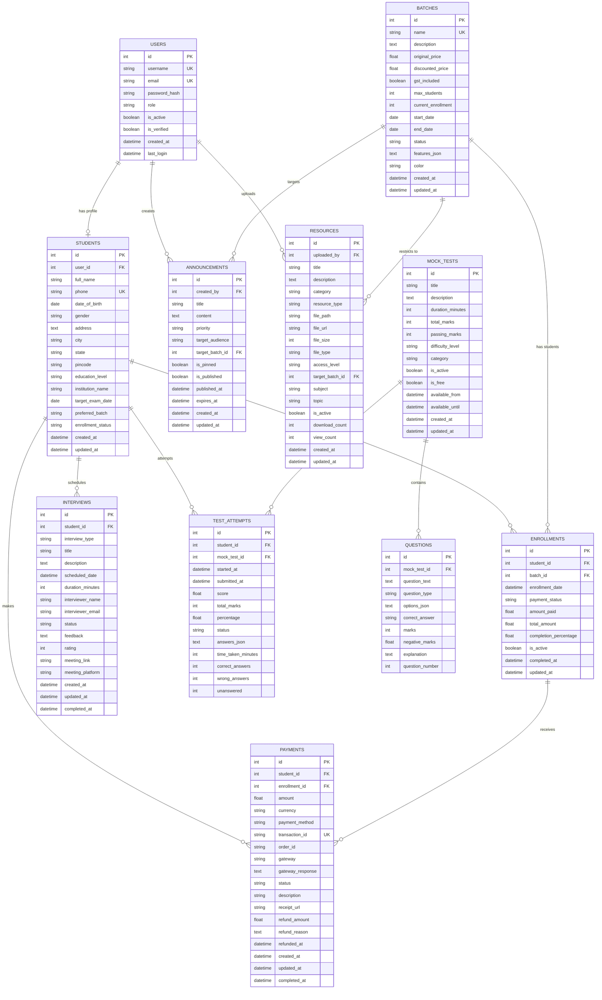

# NST Prep Database Schema

## Entity Relationship Diagram

## Table Descriptions

### Core Tables

#### users
User accounts with authentication and role-based access control.
- **Primary Key**: id
- **Unique Keys**: username, email
- **Relationships**: One-to-one with students, one-to-many with announcements and resources

#### students
Student profiles with personal and academic information.
- **Primary Key**: id
- **Foreign Keys**: user_id → users.id
- **Unique Keys**: phone
- **Relationships**: One-to-many with enrollments, interviews, test_attempts, payments

#### batches
Course batches with pricing, capacity, and scheduling.
- **Primary Key**: id
- **Unique Keys**: name
- **JSON Fields**: features_json (array of batch features)
- **Relationships**: One-to-many with enrollments, announcements, resources

#### enrollments
Links students to batches with payment and progress tracking.
- **Primary Key**: id
- **Foreign Keys**: student_id → students.id, batch_id → batches.id
- **Unique Constraint**: (student_id, batch_id)
- **Relationships**: One-to-many with payments

### Assessment Tables

#### mock_tests
Mock test configuration and metadata.
- **Primary Key**: id
- **Relationships**: One-to-many with questions and test_attempts

#### questions
Test questions with options and answers.
- **Primary Key**: id
- **Foreign Keys**: mock_test_id → mock_tests.id
- **JSON Fields**: options_json (array of answer options)

#### test_attempts
Student test attempts with scores and analytics.
- **Primary Key**: id
- **Foreign Keys**: student_id → students.id, mock_test_id → mock_tests.id
- **JSON Fields**: answers_json (dictionary of question_id: answer)

#### interviews
Interview scheduling and feedback.
- **Primary Key**: id
- **Foreign Keys**: student_id → students.id

### Content Tables

#### announcements
System announcements with targeting and scheduling.
- **Primary Key**: id
- **Foreign Keys**: created_by → users.id, target_batch_id → batches.id (optional)

#### resources
Study materials and resources with access control.
- **Primary Key**: id
- **Foreign Keys**: uploaded_by → users.id, target_batch_id → batches.id (optional)

### Financial Tables

#### payments
Payment transactions with gateway integration.
- **Primary Key**: id
- **Foreign Keys**: student_id → students.id, enrollment_id → enrollments.id
- **Unique Keys**: transaction_id

## Indexes

The following indexes are automatically created:
- Primary keys on all tables
- Unique indexes on username, email (users)
- Unique index on phone (students)
- Unique index on name (batches)
- Unique index on transaction_id (payments)
- Composite unique index on (student_id, batch_id) (enrollments)
- Foreign key indexes on all FK columns

## Data Types

- **int**: Integer (auto-incrementing for PKs)
- **string**: VARCHAR with specified length
- **text**: TEXT for long content
- **float**: FLOAT for decimal numbers
- **boolean**: BOOLEAN (TINYINT in MySQL)
- **date**: DATE
- **datetime**: DATETIME

## Cascade Rules

All foreign key relationships use `cascade='all, delete-orphan'` to ensure:
- When a parent record is deleted, all child records are automatically deleted
- Orphaned records (children without parents) are automatically cleaned up
